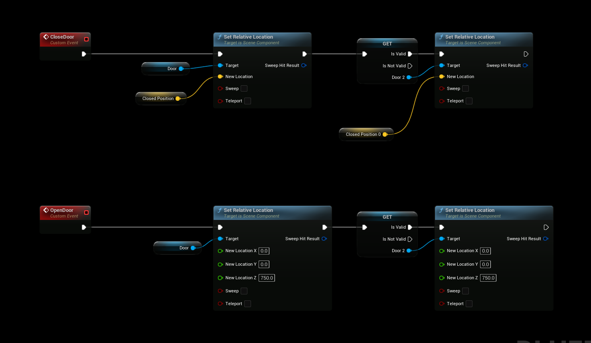

import Tabs from '@theme/Tabs';
import TabItem from '@theme/TabItem';

# Opening a Door (Trigger)

This guide demonstrates how to use gameplay events in the Gameplay Messaging System to trigger opening and closing a door in your Unreal Engine project. We'll create gameplay tags, define a data payload structure, set up event listeners, and implement overlap-based triggers to control the door's behavior.

## Prerequisites

- **Unreal Engine Project**: Ensure you have a project set up with the Gameplay Messaging System plugin installed and enabled (see [Installing the Plugin](../getting-started/introduction.md)).
- **Door Actor**: A basic Door Actor with a static mesh component that can be moved or animated to represent open and closed states.
- **Basic Blueprint Knowledge**: Familiarity with Unreal Engine Blueprints, including creating structs, gameplay tags, and event-driven logic.

## Step 1: Create Gameplay Tags

Gameplay tags are used to identify and trigger specific events in the Gameplay Messaging System. We'll create a tag to represent the door trigger event.

1. **Navigate to Gameplay Tags Settings**:
   - Open **Project Settings** from the Unreal Editor's top menu.
   - Go to **GameplayTags** under the **Game** category.
     

2. **Add a New Tag**:
   - Click **Add New Tag** or the **+** button in the Gameplay Tags section.
   - Create a new tag named `Gameplay.Trigger.Door`.
   - **Tip**: Use a descriptive name to keep your tags organized, especially in projects with many tags.
     

3. **Save Changes**:
   - Ensure the tag is saved in the Gameplay Tags list. This tag will be used as the channel for triggering door events.

## Step 2: Create a Payload Struct

To send data with the gameplay event (e.g., whether the door should open or close), we'll create a struct to act as the payload.

1. **Create a New Struct**:
   - In the **Content Browser**, right-click and select **Blueprint** > **Structure** to create a new struct.
   - Name the struct something descriptive, like `DoorStatePayload`.
     

2. **Define Struct Variables**:
   - Open the new struct in the Blueprint editor.
   - Add a single **Boolean** variable named `IsOpen` (or similar) to indicate the door's state (`true` for open, `false` for closed).
   - Save and compile the struct.
     

## Step 3: Set Up the Door Actor

The Door Actor will listen for gameplay messages and respond to overlap events to trigger the open/close behavior.

1. **Configure BeginPlay**:
   - Open your Door Actor's Blueprint.
   - In the **Event BeginPlay** node, add a **Listen for Gameplay Messages** node.
   - Set the following parameters:
     - **Channel**: Set to the `Gameplay.Trigger.Door` tag created earlier.
     - **Payload Type**: Select the `DoorStatePayload` struct.
   - This node will make the Door Actor listen for events triggered on the specified tag and process the associated payload.
     

2. **Implement Overlap Events**:
   - Use **OnComponentBeginOverlap** and **OnComponentEndOverlap** events on the Door Actor’s collision component (e.g., a Box or Sphere component) to detect when an actor (like the player) enters or exits the trigger area.
   - In **OnComponentBeginOverlap**:
     - Create a **Send Gameplay Message** node.
     - Set the **Channel** to `Gameplay.Trigger.Door`.
     - Create a new instance of the `DoorStatePayload` struct and set `IsOpen` to `true`.
   - In **OnComponentEndOverlap**:
     - Create another **Send Gameplay Message** node.
     - Set the **Channel** to `Gameplay.Trigger.Door`.
     - Create a new instance of the `DoorStatePayload` struct and set `IsOpen` to `false`.
     

3. **Handle Open/Close Logic**:
   - When the **Listen for Gameplay Messages** node receives a message, it outputs the payload (`DoorStatePayload`).
   - Use the `IsOpen` boolean from the payload to determine the door’s behavior:
     - If `IsOpen` is `true`, move or animate the door’s static mesh to the **open** position.
     - If `IsOpen` is `false`, move or animate the door’s static mesh to the **closed** position.
   - Example: Use a **Set Relative Location** or **Add Relative Rotation** node to adjust the door’s static mesh component.
     

## Step 4: Test the Setup

1. **Place the Door Actor**:
   - Add the Door Actor to your level and ensure its collision component is set up to detect overlaps (e.g., with the player pawn).
2. **Playtest**:
   - Run the game in the Unreal Editor.
   - Walk into the door’s trigger area to trigger the `OnComponentBeginOverlap` event and open the door.
   - Walk out of the trigger area to trigger the `OnComponentEndOverlap` event and close the door.

## Results

- **Closed State**: The door remains closed when no actors are overlapping the trigger area.  
  

- **Open State**: The door opens when an actor overlaps the trigger area.  
  

## Additional Notes

- **Customization**: You can expand the `DoorStatePayload` struct to include additional data, such as animation speed, sound effects, or door-specific identifiers.
- **Optimization**: Ensure the collision component’s settings (e.g., Collision Presets) are configured to detect overlaps only with relevant actors (e.g., players or specific pawn types).
- **Debugging**: If the door doesn’t respond as expected:
  - Verify the `Gameplay.Trigger.Door` tag is correctly set in both the **Send Gameplay Message** and **Listen for Gameplay Messages** nodes.
  - Check that the payload struct is properly configured and passed.
  - Use **Print String** nodes to debug the overlap events and payload values.

## Next Steps

- Explore additional gameplay messaging features, such as broadcasting messages to multiple actors or integrating with other systems (e.g., UI or audio).
- Refer to the Gameplay Messaging System documentation for advanced use cases, such as networked events or complex payload structures.
- Experiment with different door behaviors, such as timed auto-closing or locked states, by extending the payload and logic.

For further assistance, consult the plugin’s official documentation on the Unreal Engine Marketplace or reach out to the plugin developer through support channels.