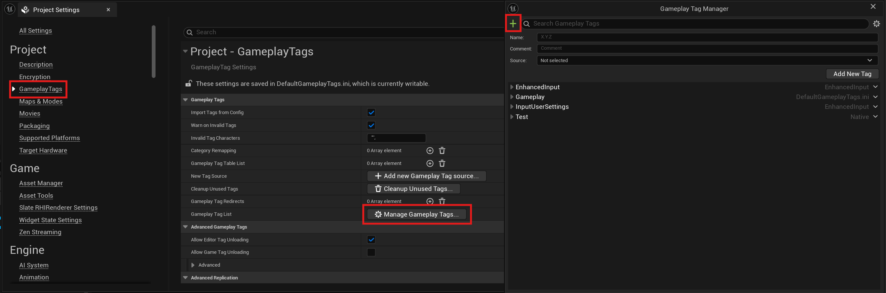
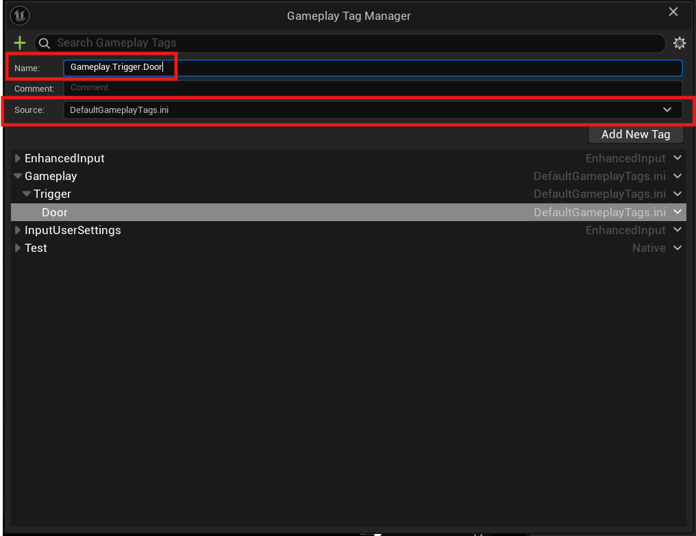
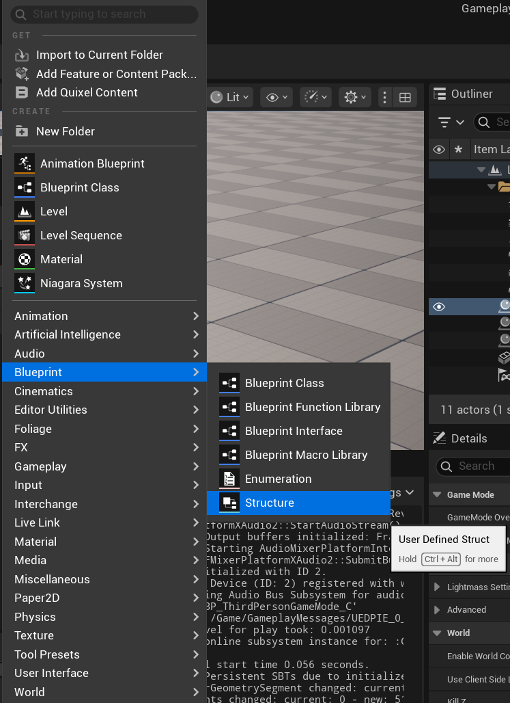

import Tabs from '@theme/Tabs';
import TabItem from '@theme/TabItem';

# Opening a Door (Button)

This guide demonstrates how to use gameplay events in the Gameplay Messaging System to trigger opening and closing a door in your Unreal Engine project using a button interaction. We'll create gameplay tags, define a data payload struct, set up event listeners in the Door Actor, and configure a Button Actor to broadcast messages that control the door's behavior.

## Prerequisites

- **Unreal Engine Project**: Ensure you have a project with the Gameplay Messaging System plugin installed and enabled (see [Installing the Plugin](../getting-started/introduction.md)).
- **Door Actor**: A Door Actor with a static mesh component that can be moved or animated to represent open and closed states.
- **Button Actor**: An Actor (e.g., a button or interactable object) with a mechanism to trigger events, such as a key press or interaction component.
- **Basic Blueprint Knowledge**: Familiarity with Unreal Engine Blueprints, including creating structs, gameplay tags, and event-driven logic.

## Step 1: Create Gameplay Tags

Gameplay tags are used to identify and trigger specific events in the Gameplay Messaging System. We'll create a tag for the door trigger event.

1. **Navigate to Gameplay Tags Settings**:
   - Open **Project Settings** from the Unreal Editor's top menu.
   - Go to **GameplayTags** under the **Game** category.
     

2. **Add a New Tag**:
   - Click **Add New Tag** or the **+** button in the Gameplay Tags section.
   - Create a new tag named `Gameplay.Trigger.Door`.
   - **Tip**: Use descriptive names to keep tags organized, especially in projects with multiple tags.
     

3. **Save Changes**:
   - Ensure the tag is saved in the Gameplay Tags list. This tag will serve as the channel for triggering door events.

## Step 2: Create a Payload Struct

To send data with the gameplay event (e.g., whether the door should open or close), we'll create a struct to act as the payload.

1. **Create a New Struct**:
   - In the **Content Browser**, right-click and select **Blueprint** > **Structure** to create a new struct.
   - Name it descriptively, such as `DoorStatePayload`.
     

2. **Define Struct Variables**:
   - Open the struct in the Blueprint editor.
   - Add a **Boolean** variable named `IsOpen` (or similar) to indicate the door’s state (`true` for open, `false` for closed).
   - Save and compile the struct.
     

## Step 3: Set Up the Door and Button Actors

The Door Actor will listen for gameplay messages, while the Button Actor will broadcast messages to trigger the door’s open/close behavior.

1. **Configure BeginPlay in the Door Actor**:
   - Open the Door Actor’s Blueprint.
   - In the **Event BeginPlay** node, add a **Listen for Gameplay Messages** node.
   - Set the following parameters:
     - **Channel**: Set to the `Gameplay.Trigger.Door` tag created earlier.
     - **Payload Type**: Select the `DoorStatePayload` struct.
   - This node enables the Door Actor to listen for events triggered on the specified tag and process the associated payload.
     

2. **Configure the Button Actor**:
   - Open the Button Actor’s Blueprint (e.g., a button, lever, or interactable object).
   - Add logic to trigger the door event, such as an **OnInteract** event or a key press (e.g., pressing the "E" key).
   - Add a **Broadcast Gameplay Message** node to send the event.
   - Set the following parameters:
     - **Channel**: Set to `Gameplay.Trigger.Door`.
     - **Payload**: Create a new instance of the `DoorStatePayload` struct.
     - Set the `IsOpen` variable to `true` to open the door or `false` to close it (you can toggle this based on the current door state or use separate interactions for open/close).
   - **Example**: If the button toggles the door state, use a boolean variable to track the current state and flip it on each interaction.
     

3. **Handle Open/Close Logic in the Door Actor**:
   - When the **Listen for Gameplay Messages** node receives a message, it outputs the `DoorStatePayload`.
   - Use the `IsOpen` boolean from the payload to determine the door’s behavior:
     - If `IsOpen` is `true`, move or animate the door’s static mesh to the **open** position.
     - If `IsOpen` is `false`, move or animate the door’s static mesh to the **closed** position.
   - Example: Use a **Set Relative Location** or **Add Relative Rotation** node to adjust the door’s static mesh component.
     

## Step 4: Test the Setup

1. **Place Actors in the Level**:
   - Add the Door Actor and Button Actor to your level.
   - Ensure the Button Actor is interactable (e.g., has a collision component or interaction system) and is positioned where the player can access it.

2. **Playtest**:
   - Run the game in the Unreal Editor.
   - Interact with the Button Actor (e.g., press "E" or click the button) to trigger the **Broadcast Gameplay Message** node.
   - Verify that the door opens or closes based on the `IsOpen` value in the payload.

## Results

- **Closed State**: The door remains closed when no interaction has occurred or when the button sends a `false` payload.  
  

- **Open State**: The door opens when the button sends a `true` payload.  
  

## Additional Notes

- **Button Interaction**: Customize the button’s interaction mechanism (e.g., key press, mouse click, or proximity trigger) based on your game’s design.
- **Toggle Logic**: For a single button that toggles the door state, store the current state in a variable and alternate between `true` and `false` in the Button Actor’s logic.
- **Customization**: Expand the `DoorStatePayload` struct to include additional data, such as door animation speed, sound effects, or a specific door ID for targeting multiple doors.
- **Optimization**: Ensure the Button Actor’s interaction system is efficient (e.g., use appropriate collision settings or interaction components).
- **Debugging**: If the door doesn’t respond:
  - Verify the `Gameplay.Trigger.Door` tag is correctly set in both the **Broadcast Gameplay Message** and **Listen for Gameplay Messages** nodes.
  - Check that the payload struct is properly configured and passed.
  - Use **Print String** nodes to debug the button interaction and payload values.

## Next Steps

- Explore advanced features of the Gameplay Messaging System, such as broadcasting to multiple actors or handling networked events.
- Add visual or audio feedback to the button (e.g., a press animation or sound effect) to enhance the player experience.
- Experiment with complex interactions, such as requiring multiple button presses or combining with other triggers (e.g., pressure plates).
- Refer to the plugin’s official documentation on the Unreal Engine Marketplace for additional use cases and configuration options.

For further assistance, consult the plugin’s documentation or contact the plugin developer through Marketplace support channels.