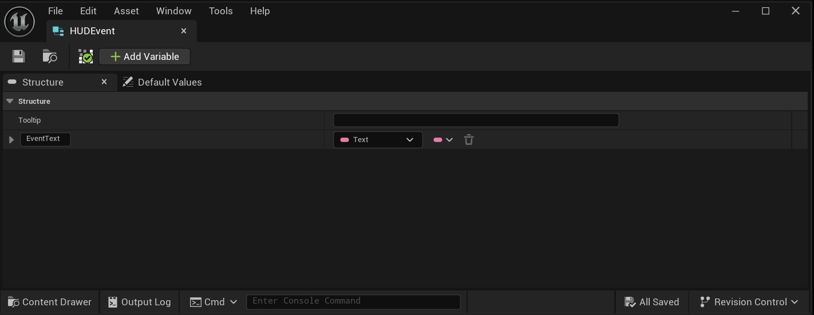
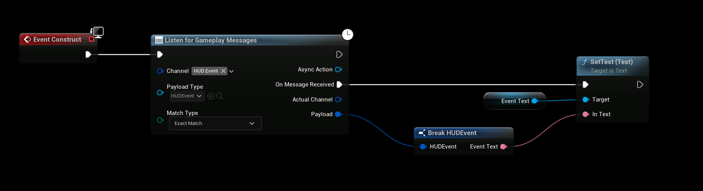
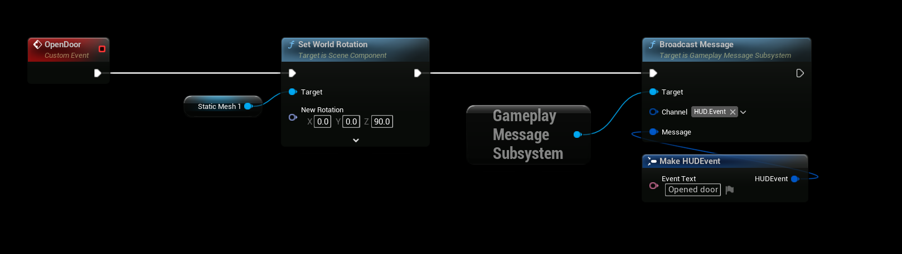
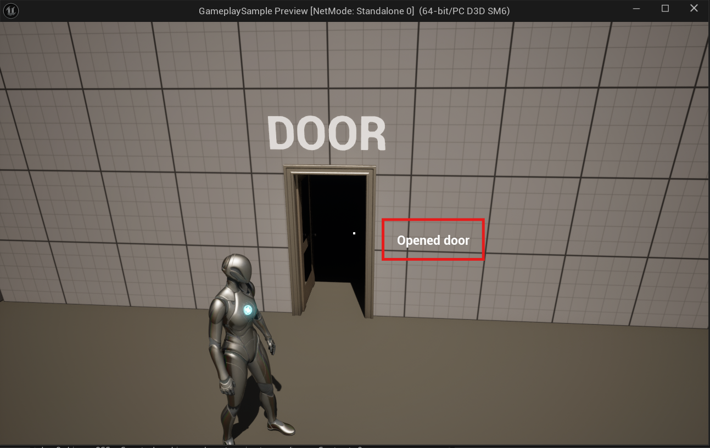

import Tabs from '@theme/Tabs';
import TabItem from '@theme/TabItem';

# Triggering Widgets

This guide shows how to use the **Gameplay Messaging System** to trigger UI updates or widget creation in Unreal Engine — without any direct references or complex event binding. We'll broadcast a message from gameplay logic (e.g., a door interaction) to update a HUD widget in real time.

---

## Overview

You can send structured data from any Actor, Blueprint, or system to your UI using gameplay messages. This decouples your gameplay logic from your UI, making it easier to maintain and extend.

In this example:
- A **Door Actor** sends a message when opened or closed.
- A **HUD Widget** listens for that message and updates a text field.

---

## Step 1: Create the Payload Struct

We'll create a simple struct to carry data from gameplay to the UI.

1. In the **Content Browser**, right-click → **Blueprint** → **Structure**.
2. Name it `HUDEventPayload`.
3. Add a **Text** variable named `EventText`.

> **Tip**: Use descriptive names. This struct can be expanded later (e.g., to include icons, colors, or duration).

---

## Step 2: Set Up the HUD Widget

The widget will **listen** for incoming messages and update its UI accordingly.

1. Open your HUD Widget Blueprint (e.g., `WBP_HUD`).
2. In **Event Graph**, add a **Listen for Gameplay Messages** node on **Event Construct** or **Begin Play**.
3. Configure the node:
   - **Channel**: `HUD.Event` (create this tag in **Project Settings > Gameplay Tags**)
   - **Payload Type**: `HUDEventPayload`

4. From the **On Message Received** pin:
   - Pull the `EventText` from the payload.
   - Set it to a **Text Block** in your widget (e.g., named `EventText`).

---

## Step 3: Broadcast the Message from Gameplay

Now trigger the message from any actor — in this case, a door.

1. Open your **Door Actor** Blueprint.
2. In the interaction logic (e.g., on open/close), add a **Broadcast Gameplay Message** node.
3. Configure:
   - **Channel**: `HUD.Event`
   - **Payload**: Create a new `HUDEventPayload`
   - Set `EventText` to something like `"Door Opened!"` or `"Door Closed."`

> You can dynamically construct the message based on context (player name, door ID, etc.).

---

## Step 4: Test the Result

1. Add the HUD Widget to your viewport (via Player Controller or Game Mode).
2. Play in Editor (PIE).
3. Interact with the door.

**Result**: The text in your HUD updates instantly!

---

## Benefits of This Approach

| Feature | Benefit |
|-------|--------|
| **No References** | Door doesn’t need to know about the HUD |
| **Reusable** | Same message can update multiple widgets |
| **Scalable** | Add more UI elements (icons, animations, sounds) easily |
| **Designer-Friendly** | All logic in Blueprints, no C++ required |

---

## Advanced Tips

- **Multiple Listeners**: Any number of widgets or systems can listen to `HUD.Event`.
- **Filtering**: Use additional tags (e.g., `HUD.Event.Door`, `HUD.Event.Player`) for specific updates.
- **Auto-Remove**: Add a timer in the widget to fade out messages after a few seconds.