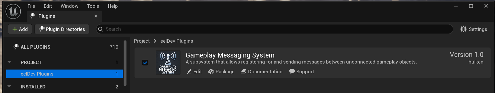

import Tabs from '@theme/Tabs';
import TabItem from '@theme/TabItem';

# Installing the Gameplay Messaging System Plugin

This guide provides detailed steps to install and configure the Gameplay Messaging System plugin for your Unreal Engine project. Follow these instructions to ensure proper setup and integration.

## Prerequisites

- **Unreal Engine**: Ensure you have Unreal Engine installed (version compatible with the plugin, typically specified in the plugin's documentation).
- **Epic Games Launcher**: Required to access and download the plugin from the Unreal Engine Marketplace.
- **Project Access**: You need administrative access to your Unreal Engine project directory.

## Installation Steps

1. **Install the Plugin via Epic Launcher**  
   - Open the **Epic Games Launcher** on your computer.
   - Navigate to the **Unreal Engine** section and select the **Marketplace** tab.
   - Search for **Gameplay Messaging System** in the search bar.
   - Click on the plugin, then select **Install to Engine** or **Add to Project** (depending on your workflow).
     - **Install to Engine**: Adds the plugin to your Unreal Engine installation, making it available for all projects.
   - Follow the prompts to complete the installation. The plugin will be downloaded to your Engine’s plugin directory (e.g., `C:\Program Files\Epic Games\UE_X.XX\Engine\Plugins\Marketplace`).

2. **Enable the Plugin in Your Project**  
   - Open your Unreal Engine project in the Unreal Editor.
   - Go to **Edit** > **Plugins** in the top menu.
   - In the **Plugins** window, locate the **Gameplay Messaging System** plugin under the **Installed** or **Marketplace** category.
   - Check the **Enabled** checkbox next to the plugin.
   - Restart the Unreal Editor when prompted to apply the changes.  
     

3. **Optional: Move the Plugin to Your Project’s Plugins Folder**  
   - By default, the plugin is installed in the Engine’s plugin directory. To make your project more portable or to customize the plugin, you can move it to your project’s `Plugins` folder.
   - **Steps**:
     - Locate the plugin in your Engine directory (e.g., `C:\Program Files\Epic Games\UE_X.XX\Engine\Plugins\Marketplace\GameplayMessagingSystem`).
     - Copy the entire `GameplayMessagingSystem` folder.
     - Paste it into your project’s `Plugins` folder (e.g., `YourProject/Plugins/`).
     - If the `Plugins` folder doesn’t exist, create it in your project’s root directory.
     - Reopen your project in the Unreal Editor. The plugin will now load from the project’s `Plugins` folder instead of the Engine directory.
   - **Why do this?**
     - Ensures the plugin is included when sharing or archiving your project.
     - Allows for project-specific modifications to the plugin without affecting other projects.
     - Note: This step is optional and not required for the plugin to function.

## Troubleshooting

- **Plugin Not Visible in Editor**: Ensure the plugin is installed for the correct Unreal Engine version and that you’ve restarted the Editor after enabling it.
- **Errors During Build**: If you encounter build errors, ensure the plugin is compatible with your project’s Unreal Engine version and that it’s placed in the correct directory (Engine or Project).