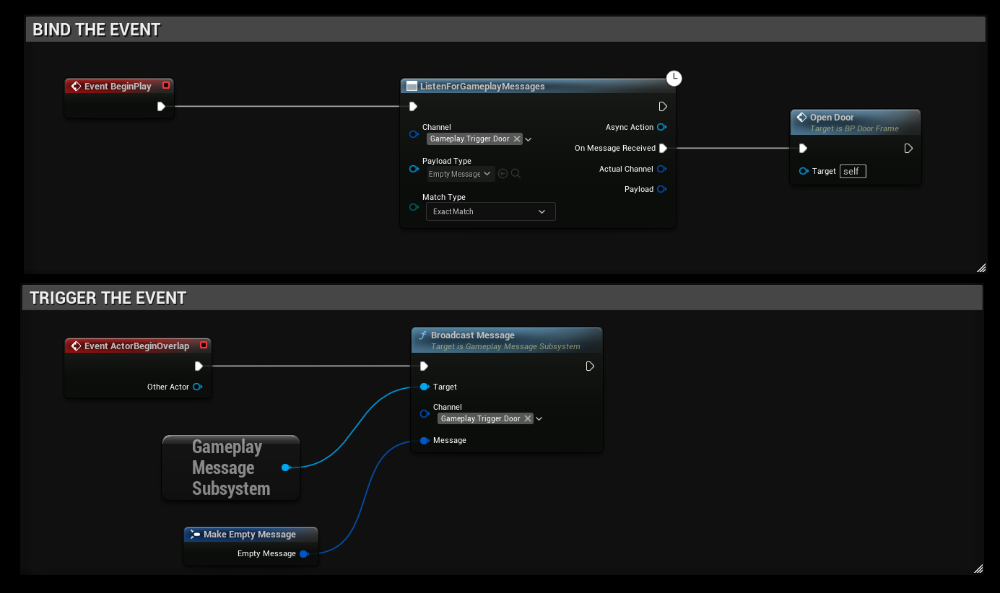
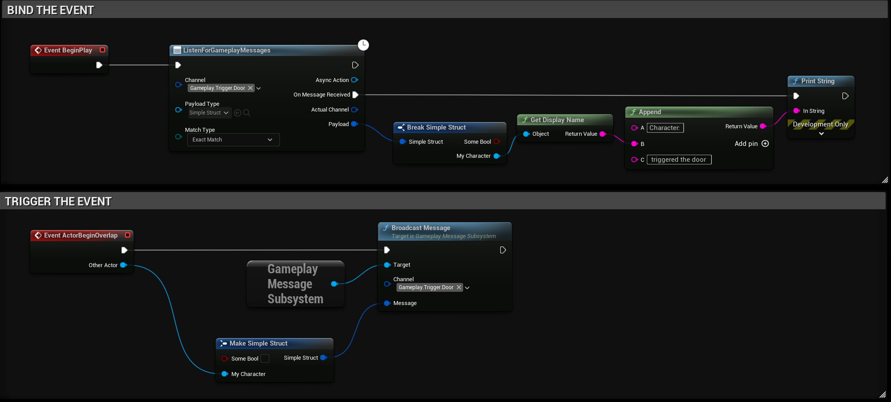

import Tabs from '@theme/Tabs';
import TabItem from '@theme/TabItem';

# Using the Gameplay Messaging System Plugin
Using the plugin is very straight forward and easy, here are some examples on how you can use the plugin.

Binding and Triggering a "Door" event.

Binding and Triggering a "Door" event that includes the Character triggering the event.
